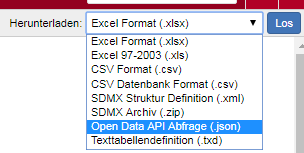

# STATcubeR 

R Interface für die STATcube REST API

## Installation

Falls die Portal-Credentials am R Server hinterlegt sind, kann über
`install_statbucket()` installiert werden.

``` r
rinstSTAT::install_statbucket("METH/STATcubeR")
library(STATcubeR)
```

Sonst ist auch eine Installation mit `git clone`/`R CMD INSTALL` möglich

    git clone ssh://git@gitrepo:7999/METH/STATcubeR.git
    R CMD INSTALL STATcubeR

## Verwendung

Zur Verwendung diese Paketes sind folgende Schritte notwendig

  - (einmalig) Hinzufügen des API Keys zum authSTAT-Vault
  - Herunterladen einer API Abfrage von STATcube. (JSON-Format)
  - Absenden der Abfrage über den R Server
  - Konvertieren der API-Response in ein typisches R Datenformat

### Hinzufügen des API Keys

Zum verwenden dieses Pakets muss einmalig ein API-Schlüssel für STATcube
auf den R Server geladen werden. Rufen Sie die Funktion
`sc_browse_preferences()` auf. Nun öffnet sich ein Browserfenster in dem
der Schlüssel sichtbar ist. Eventuell muss davor Windows-User und
Windows-Passwort eingegeben werden. Kopieren Sie den Schlüssel in die
Zwischenablage.

``` r
sc_browse_preferences()
```

Rufen Sie nun die Funktion `statcube_token_set()` auf. Ersetzen Sie
dabei `"XXXX"` durch den vorhin kopierten Token.

``` r
sc_token_set("XXXX")
#> STATcube Key wurde erfolgreich getestet und im Vault hinterlegt
```

### Herunterladen der API Abfrage

Laden sie eine “Open Data API Abfrage” über die STATcube GUI herunter.
Erstellen Sie hierzu eine STATcube Tabelle und wählen Sie “API Abfrage”
als Download-Option.



Nun wird eine json-Datei auf dem Windows-System abgelegt

### Absenden der Abfrage

Geben Sie den Pfad zu dem heruntergeladenen JSON-File in der Funktion
`sc_get_response()` ein, um die API Abfrage auszuführen.

``` r
my_response <- sc_get_response("pfad/zu/api_abfrage.json")
```

Alternativ kann mit der Funktion `sc_upload_json()` die json-Datei über
einen Upload-Dialog angegeben werden.

``` r
my_response <- sc_upload_json()
```

Das Objekt `my_response` beinhaltet die “rohe” API-Response. Die
Print-Methode gibt einen Einblick in die Abfrage.

``` r
(json_pfad <- sc_example("bev_seit_1982.json"))
#> /data/home/decill/projects/STATcubeR/inst/json_examples/bev_seit_1982.json
my_response <- sc_get_response(json_pfad)
my_response
#> Objekt der Klasse STATcube_response
#> 
#> Datenbank:     Bevölkerung zu Jahresbeginn ab 1982 
#> Werte:         Fallzahl 
#> Dimensionen:   Jahr, Bundesland, Geburtsland 
#> 
#> Abfrage:       2020-07-30 15:59:13 
#> STATcubeR:     0.1.0
```

### Umwandeln in typische R-Datenformate

Um die importierten Daten in R zu nutzen kann `as.data.frame()` oder
`as.array()` verwendet werden.

``` r
as.array(my_response)
as.data.frame(my_response)
```

Im Falle von `as.data.frame()` wird ein tidy Datensatz zurückgegeben,
der jede Dimension des Cubes als Spalte enthält. Außerdem gibt es zwei
Spalten pro Wert. Beispiel:

``` r
set.seed(1234)
as.data.frame(my_response) %>% dplyr::sample_n(10)
#>        Jahr                Bundesland Geburtsland Fallzahl Fallzahl_a
#> 1  Zusammen              Tirol <AT33>    Zusammen        0          X
#> 2      2011 Nicht klassifizierbar <0>  Österreich        0           
#> 3      2015         Burgenland <AT11>    Zusammen   288356           
#> 4      2011           Salzburg <AT32>     Ausland    82391           
#> 5      1999 Nicht klassifizierbar <0>     Ausland        0          X
#> 6      2008           Salzburg <AT32>     Ausland    80421           
#> 7      2000         Steiermark <AT22>    Zusammen        0          X
#> 8      2009     Oberösterreich <AT31>  Österreich  1238869           
#> 9      1993            Kärnten <AT21>  Österreich        0          X
#> 10     2008   Niederösterreich <AT12>    Zusammen  1595503
```

Die Spalte `Fallzahl_a` enthält die Anmerkungen (Annotations) zur Spalte
`Fallzahl`. Um die Bedeutungen der Annotations zu sehen kann
`sc_annotation_legend()` verwendet werden.

``` r
sc_annotation_legend(my_response)
#> $Q
#> [1] "STATcube – Statistische Datenbank von STATISTIK AUSTRIA"
#> 
#> $X
#> [1] "Verkreuzung nicht erlaubt"
```

In diesem Fall ist der Nuller in Zeile 2 ein “echter nuller” und der
Nuller in Zeile 1 steht für einen gesperrten Wert.

### Sonstiges

Um den Inhalt der Response zu erhalten, kann `httr::content()` verwendet
werden.

``` r
my_content <- httr::content(my_response$response)
names(my_content)
#> [1] "query"         "database"      "measures"      "fields"       
#> [5] "cubes"         "annotationMap"
my_content$measures
#> [[1]]
#> [[1]]$uri
#> [1] "str:statfn:debevstandjb:F-BEVSTANDJB:F-ISIS-1:SUM"
#> 
#> [[1]]$label
#> [1] "Fallzahl"
#> 
#> [[1]]$measure
#> [1] "str:measure:debevstandjb:F-BEVSTANDJB:F-ISIS-1"
#> 
#> [[1]]$`function`
#> [1] "SUM"
```

Die Endpoints `/info`, `/schema` und `/rate_limit` sind testweise
angebunden aber noch nicht exportiert.

``` r
STATcubeR:::sc_get_info() %>% httr::content()
STATcubeR:::sc_get_schema() %>% httr::content()
STATcubeR:::sc_get_rate_limit() %>% httr::content()
```

Gespeicherte Tabellen lassen sich über die `id` laden. Hierzu ist kein
JSON notwendig.

``` r
sc_saved_tables_list()
#>               label                                             id
#> 1 krankenbewegungen str:table:c7902e8d-5165-44e9-b17e-34ae20e2d1d4
#> 2        tourism_ts str:table:eec7dd70-25c4-4e5a-a6ae-1a9cd15d3c4c
tourism_ts <- sc_saved_table("str:table:eec7dd70-25c4-4e5a-a6ae-1a9cd15d3c4c")
tourism_ts
#> Objekt der Klasse STATcube_response
#> 
#> Datenbank:     Nächtigungsstatistik ab 1974 nach Saison 
#> Werte:         Übernachtungen 
#> Dimensionen:   Regionale Gliederung [teilw. SPE], Saison/Tourismusmonat, Herkunftsland 
#> 
#> Abfrage:       2020-07-30 15:59:17 
#> STATcubeR:     0.1.0
```

STATcube verfügt über einen Cache. Wenn die selbe Abfrage mehrmals
abgeschickt wird, so wird das Rate-Limit (1000 Anfragen pro Stunde)
nicht belastet. Sämtliche Anfragen werden an die externe STATcube
Instanz gesendet. Eine Überlastung der API kann somit die UX von
externen Nutzern negativ beeinflussen.

## TODO

  - Erklären der Begriffe Datenbank, Werte und Dimensionen
  - Verwenden der URIs, um Variablen auch als Codes (nicht Labels)
    anzubieten. Könnte sein, dass hierzu der `/schema`-Endpoint
    notwendig ist.
      - `my_content$fields[[i]]$items[[j]]$uris[[1]]`
      - `my_content$fields[[i]]$uri`
      - `my_content$database$uri`
      - `my_content$measures[[i]]$uri`
  - Fehlermeldung, falls `my_response$status_code != 200`

## API Dokumentation

  - `/table` Endpoint:
    <https://docs.wingarc.com.au/superstar/latest/open-data-api/open-data-api-reference/table-endpoint>
  - `/schema` Endpoint:
    <https://docs.wingarc.com.au/superstar/latest/open-data-api/open-data-api-reference/schema-endpoint>
